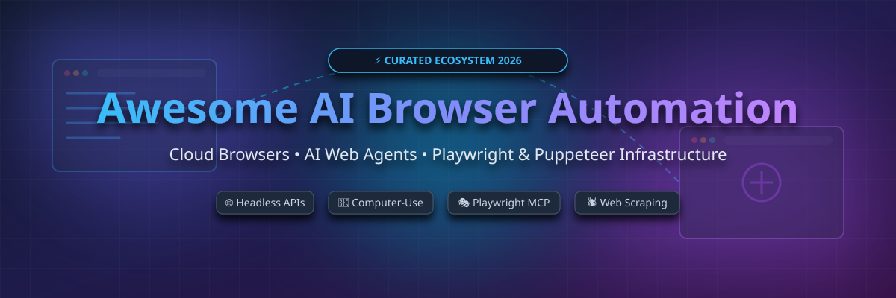

# Awesome AI Browser Automation 🚀

  

  
  
  
  

---

## 🤖 Top AI Browser Automation & Web Scraping Ecosystem

**A Curated List of SaaS Cloud Browsers, AI Web Agents, Playwright/Puppeteer Infrastructure, Computer-Use Agents & Headless Browser APIs** 🌐

> 💡 **SEO & Tech Overview**: Welcome to the definitive guide on **AI Browser Automation**, **Cloud Headless Browsers**, and **Autonomous Web Agents**. Whether you are building LLM agents with **Playwright**, **Stagehand**, **browser-use**, or **Puppeteer**, scaling infrastructure via **Browserbase**, **Steel.dev**, or **Browserless**, or handling anti-bot stealth scraping with **ZenRows** and **Scrapfly**, this list curates the top tools for modern developer stacks.

---

## 📑 Table of Contents

- [📊 Sector Overview & Market Size](#-sector-overview--market-size)
- [☁️ SaaS & Hosted Cloud Browser Platforms](#%EF%B8%8F-saas--hosted-cloud-browser-platforms)
- [💻 Open-Source GitHub Projects & Frameworks](#-open-source-github-projects--frameworks)
- [🤝 How to Contribute](#-how-to-contribute)
- [☕ Support & Community](#-support--community)
- [⚠️ Disclaimer](#%EF%B8%8F-disclaimer)
- [📈 Star History](#-star-history)

---

## 📊 Sector Overview & Market Size

> 📈 **Market Insights**: The global AI Web Scraping & Browser Automation market size is estimated at **$6.2B – $7.8B** (projected to reach **$23.7B+ by 2030** at a 17%-23% CAGR), while the AI Browser Agent market is growing at a 35%+ CAGR. The sector is **moderately concentrated and rapidly consolidating**—while core browser engines (Playwright, Puppeteer) power open-source foundations, top cloud browser platforms (Browserbase, Steel, Browserless) command significant market share by providing dedicated stealth execution, anti-bot bypass (Cloudflare/DataDome), and scalable multi-session hosting.

---

## ☁️ SaaS & Hosted Cloud Browser Platforms

Below is a curated comparison of leading commercial hosted browser platforms, sorted by estimated company size/valuation (descending):

| Platform 🚀 | Description 📝 | Starting Paid Tier 💰 | Free Tier / Trial Limit 🎁 | Size / Valuation (Est.) 🏢 |
| :--- | :--- | :--- | :--- | :--- |
| **[Browserbase](https://www.browserbase.com/)** | Enterprise cloud browser infrastructure for AI agents with stealth session control, CAPTCHA solving, and Stagehand SDK integration. | **$20/month** (Developer Plan: 100 hrs, 25 concurrency) | **1 browser hour/month free** (3 concurrent sessions, $5 LLM credits) | **$300M Valuation** ($67.5M raised led by Notable Capital & KP) |
| **[Browserless](https://www.browserless.io/)** | Scalable hosted headless Chrome/Playwright cluster API for web scraping, PDF rendering, and AI agent workloads. | **$50/month** (Starter Plan for base browser-hours) | **1,000 free units/month** free forever | **$1.3M+ ARR** (Bootstrapped, acquired by N枢 Stack) |
| **[ZenRows](https://www.zenrows.com/)** | Web scraping API and anti-detect browser service designed to bypass Cloudflare, DataDome, and Akamai. | **$69/month** (Developer Plan with anti-bot bypass) | **5,000 free credits** (14-day free trial) | **$1.2M Seed Funded** (4Founders, Athos Capital, Bynd VC) |
| **[Anchor Browser](https://anchorbrowser.io/)** | Enterprise AI browser automation platform featuring built-in proxy rotation and agent security sandboxing. | **$50/month** (Starter Plan) | **5 monthly credits** (or 6 months free for startups) | **$6M Seed Funded** (Led by Blumberg Capital & Gradient Ventures) |
| **[Scrapfly](https://scrapfly.io/)** | Web scraping & browser API with anti-bot bypass, ASP proxies, and headless Chrome rendering. | **$30/month** (Discovery Plan: 200,000 credits) | **1,000 free API credits** on signup (never expires) | **Bootstrapped SaaS** (Independent profitable run-rate) |
| **[Hyperbrowser](https://www.hyperbrowser.ai/)** | High-performance hosted browser infrastructure built for AI agents with anti-detect features and instant session scaling. | **$30/month** (Startup Plan: 30,000 credits) | **5,000 starter credits** free tier | **YC S21 VC-Backed** (Y Combinator, Accel, SV Angel) |
| **[Steel.dev](https://steel.dev/)** | Open-source friendly cloud browser API built specifically for AI agents, multi-tab sessions, and browser context persistence. | **$250/month** (Scale Plan) or pay-as-you-go (~$0.10/hr) | **$30 free credit** (~300 browser hours) on signup | **YC W24 Seed Funded** (Y Combinator, Antler) |

---

## 💻 Open-Source GitHub Projects & Frameworks

The open-source ecosystem powers the vast majority of AI browser agents. The list below is sorted by **GitHub Star Count** (descending):

| Repo & Project Name 🛠️ | Description 📖 | GitHub Stars ⭐ |
| :--- | :--- | :--- |
| **[Firecrawl](https://github.com/mendableai/firecrawl)** |  | Turn entire websites into clean LLM-ready markdown or structured data with single API calls. |
| **[browser-use](https://github.com/browser-use/browser-use)** |  | Top trending Python framework connecting LLMs directly to browser controls for autonomous web tasks. |
| **[Puppeteer](https://github.com/puppeteer/puppeteer)** |  | Google's Node.js library for controlling headless Chrome and Chromium over DevTools Protocol. |
| **[Playwright](https://github.com/microsoft/playwright)** |  | Microsoft's premier cross-browser automation library for Node.js, Python, Java, and .NET. |
| **[Crawl4AI](https://github.com/unclecode/crawl4ai)** |  | Open-source LLM-friendly web crawler & scraper engineered for AI pipelines and RAG applications. |
| **[Scrapy](https://github.com/scrapy/scrapy)** |  | High-level fast web crawling and web scraping framework for Python. |
| **[Playwright MCP Server](https://github.com/microsoft/playwright-mcp)** |  | Model Context Protocol server giving AI coding agents (Claude, Cursor, Antigravity) native Playwright control. |
| **[Selenium](https://github.com/SeleniumHQ/selenium)** |  | Browser automation framework and WebDriver standard for enterprise browser testing. |
| **[Stagehand](https://github.com/browserbase/stagehand)** |  | Open-source TypeScript SDK for AI browser control using natural language actions built on Playwright. |
| **[Skyvern](https://github.com/Skyvern-AI/skyvern)** |  | Computer vision + LLM agent that automates complex browser workflows on dynamic UIs without fixed selectors. |
| **[CAMEL](https://github.com/camel-ai/camel)** |  | Open-source communicative agent framework for multi-agent web automation and research. |
| **[Browserless Open](https://github.com/browserless/browserless)** |  | Dockerized headless Chrome grid engine for self-hosting custom browser automation clusters. |
| **[AgentOps](https://github.com/AgentOps-AI/agentops)** |  | Observability, evaluation, and monitoring suite for AI web browser agents. |

---

## 🤝 How to Contribute

Contributions are welcome! Please follow these simple guidelines:

1. Fork this repository 🍴
2. Create a feature branch (`git checkout -b feature/new-tool`)
3. Add or edit entries in `README.md` following the tabular layout.
4. Submit a Pull Request with a clear description of the project.

---

## ☕ Support & Community

If you find this repository helpful, please consider giving it a ⭐ star, sharing it with fellow developers, or supporting the maintainer:

  
  

Thank you for helping us keep AI browser automation open and community-driven! ❤️

---

## ⚠️ Disclaimer

- This repository is a community-curated collection for informational and educational purposes.
- Always comply with website Terms of Service, respect `robots.txt`, and obey regional data scraping rules.
- Autonomous AI web agents can perform irreversible actions; implement proper human-in-the-loop controls.

---

## 📈 Star History

---

  <b>Made with ❤️ for AI Agent Builders &amp; Automation Engineers worldwide.</b>

